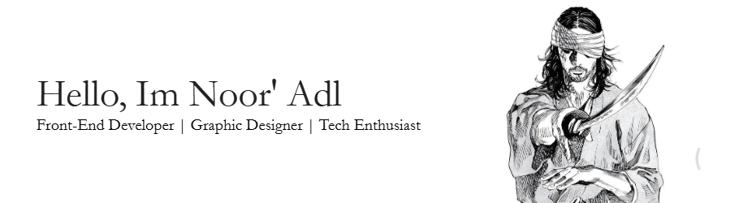

## About Me
I'm a Front-End Web Developer and Graphic Designer passionate about crafting clean, responsive, and engaging websites. I specialize in building fluid interfaces with smooth transitions, animations, and custom user experiences that feel both intuitive and inspiring. I enjoy bringing life to pixels, making ideas not just visible—but tangible.

But my journey isn't just about code.

I'm also a lifelong learner, constantly exploring not only new technologies, but also timeless philosophies. I'm currently diving deep into the principles of Stoicism—seeking clarity, discipline, and inner peace through simplicity and self-awareness. To me, every project is more than a task—it's a part of a greater journey to grow both as a creator and as a human being.

As I build user interfaces, I'm also building myself.
Through design, development, and contemplation, I embrace the path of becoming—
a personal adventure in mastering not only my craft, but also my mind.

---

## Tech Stack

  
  
  
  
  
  
  
  
  
  
  
  
  
  
  
  
  
  
  

---

## Connect With Me

---

## Stats

<!-- Proudly created with GPRM ( https://gprm.itsvg.in ) -->
